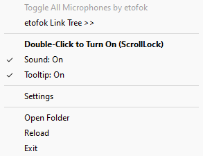

# Toggle All Microphones by etofok
 Elegant solution to Toggle All Microphones On and Off

 <--> 

# (!) IMPORTANT AND REQUIRED:

(!) Requires AutoHotkey v1.1 (not v2.0). 
Download here: https://www.autohotkey.com/

[**Download Toggle All Microphones >> Click Here**](https://github.com/etofok/Toggle-All-Microphones/archive/refs/heads/main.zip)

[**etofok LinkTree >>**](https://linktr.ee/etofok)

## The Story

Once upon a time there was an employee who needed a software solution to quickly turn on and off all of his microphones to avoid being heard.

He also wanted it to be simple but modifiable.

Toggle All Microphones solves exactly this need.

## Quick Summary

**Toggle All Microphones** helps users easily and conveniently Turn On or Turn Off all their input devices at once.

**Toggle All Microphones** has very gentle alert sounds and shows a tiny tooltip on screen to indicate change.
You can disable these in Settings.

The icon in Tray indicates the current state.

## What's in the Package

| File Name                 | Extension         | Purpose |
| :----------------         | :------           | :---- |
| _Toggle All Microphones   |   .ahk            | The App itself (RUN THIS!) |
| Settings                  |   .ahk            | The Settings File |
| misc\Sounds\On            |   .wav            | Sound for 'Turned On' |
| misc\Sounds\Off           |   .wav            | Sound for 'Turned Off' |
| misc\icons\On             |   .ico            | Icon for 'Turned On' |
| misc\icons\Off            |   .ico            | Icon for 'Turned Off' |
| misc\VA                   |   .ahk            | VA Library |
